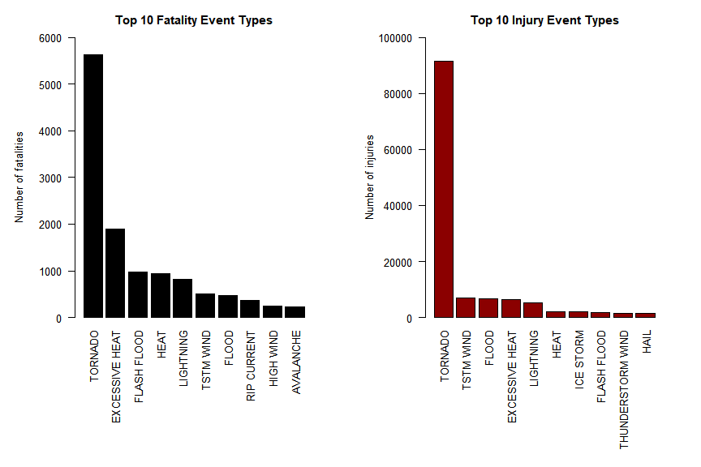
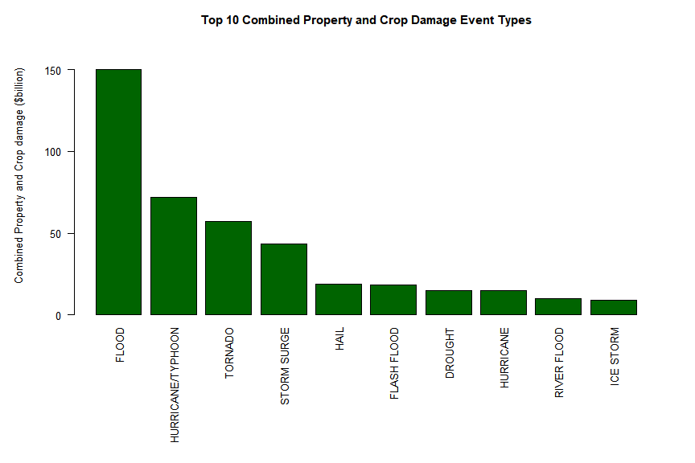

###**Synopsis**

Storms and other severe weather events can cause both public health and economic problems for communities and municipalities. Many severe events can result in fatalities, injuries, and property damage, and preventing such outcomes to the extent possible is a key concern.

This project involves exploring the U.S. National Oceanic and Atmospheric Administration's (NOAA) **Storm Events Database**. This database tracks characteristics of major storms and weather events in the United States, including when and where they occur, as well as estimates of any fatalities, injuries, and property damage. The data sourced for this project comprised 902,297 observations of 37 variables taken across the United States from January 1950 to November 2011.

This analysis was undertaken to identify the types of weather events that had the greatest health and economic consequences across the United States from 1950 to 2011.

Tornado events were found to have the greatest health consequences, causing 5,633 fatalities and 91,346 injuries.

Flood events were found to have the greatest economic consequences, causing 150 billion dollars in combined property and crop damage.

###**Data Processing**

####**Download and unzip data into R**

The data was originally sourced from the U.S. National Ocean and Atmospheric Administration's (NOAA) **Storm Events Database**.

The data was downloaded from the Coursera website using the URL https://d396qusza40orc.cloudfront.net/repdata%2Fdata%2FStormData.csv.bz2. A study of the URL name showed that the filename was **repdata_data_StormData.csv.bz2**. This file was downloaded into the R working directory and unzipped into a dataframe called **stormdata**. Once this was done, a check was made of the dataframe's structure to find the number of rows and columns, and to identify the type of data stored for each variable.


```r
# download and read data into R

# define working names for URL and filename
        url <- "https://d396qusza40orc.cloudfront.net/repdata%2Fdata%2FStormData.csv.bz2"
        filename <- "repdata_data_StormData.csv.bz2"
        
# download file from url
        download.file(url, filename)
        
# read data in to R dataframe
        stormdata <- read.csv(filename)
        
# check dataframe characteristics
        str(stormdata)
```

```
## 'data.frame':	902297 obs. of  37 variables:
##  $ STATE__   : num  1 1 1 1 1 1 1 1 1 1 ...
##  $ BGN_DATE  : Factor w/ 16335 levels "1/1/1966 0:00:00",..: 6523 6523 4242 11116 2224 2224 2260 383 3980 3980 ...
##  $ BGN_TIME  : Factor w/ 3608 levels "00:00:00 AM",..: 272 287 2705 1683 2584 3186 242 1683 3186 3186 ...
##  $ TIME_ZONE : Factor w/ 22 levels "ADT","AKS","AST",..: 7 7 7 7 7 7 7 7 7 7 ...
##  $ COUNTY    : num  97 3 57 89 43 77 9 123 125 57 ...
##  $ COUNTYNAME: Factor w/ 29601 levels "","5NM E OF MACKINAC BRIDGE TO PRESQUE ISLE LT MI",..: 13513 1873 4598 10592 4372 10094 1973 23873 24418 4598 ...
##  $ STATE     : Factor w/ 72 levels "AK","AL","AM",..: 2 2 2 2 2 2 2 2 2 2 ...
##  $ EVTYPE    : Factor w/ 985 levels "   HIGH SURF ADVISORY",..: 834 834 834 834 834 834 834 834 834 834 ...
##  $ BGN_RANGE : num  0 0 0 0 0 0 0 0 0 0 ...
##  $ BGN_AZI   : Factor w/ 35 levels "","  N"," NW",..: 1 1 1 1 1 1 1 1 1 1 ...
##  $ BGN_LOCATI: Factor w/ 54429 levels "","- 1 N Albion",..: 1 1 1 1 1 1 1 1 1 1 ...
##  $ END_DATE  : Factor w/ 6663 levels "","1/1/1993 0:00:00",..: 1 1 1 1 1 1 1 1 1 1 ...
##  $ END_TIME  : Factor w/ 3647 levels ""," 0900CST",..: 1 1 1 1 1 1 1 1 1 1 ...
##  $ COUNTY_END: num  0 0 0 0 0 0 0 0 0 0 ...
##  $ COUNTYENDN: logi  NA NA NA NA NA NA ...
##  $ END_RANGE : num  0 0 0 0 0 0 0 0 0 0 ...
##  $ END_AZI   : Factor w/ 24 levels "","E","ENE","ESE",..: 1 1 1 1 1 1 1 1 1 1 ...
##  $ END_LOCATI: Factor w/ 34506 levels "","- .5 NNW",..: 1 1 1 1 1 1 1 1 1 1 ...
##  $ LENGTH    : num  14 2 0.1 0 0 1.5 1.5 0 3.3 2.3 ...
##  $ WIDTH     : num  100 150 123 100 150 177 33 33 100 100 ...
##  $ F         : int  3 2 2 2 2 2 2 1 3 3 ...
##  $ MAG       : num  0 0 0 0 0 0 0 0 0 0 ...
##  $ FATALITIES: num  0 0 0 0 0 0 0 0 1 0 ...
##  $ INJURIES  : num  15 0 2 2 2 6 1 0 14 0 ...
##  $ PROPDMG   : num  25 2.5 25 2.5 2.5 2.5 2.5 2.5 25 25 ...
##  $ PROPDMGEXP: Factor w/ 19 levels "","-","?","+",..: 17 17 17 17 17 17 17 17 17 17 ...
##  $ CROPDMG   : num  0 0 0 0 0 0 0 0 0 0 ...
##  $ CROPDMGEXP: Factor w/ 9 levels "","?","0","2",..: 1 1 1 1 1 1 1 1 1 1 ...
##  $ WFO       : Factor w/ 542 levels ""," CI","$AC",..: 1 1 1 1 1 1 1 1 1 1 ...
##  $ STATEOFFIC: Factor w/ 250 levels "","ALABAMA, Central",..: 1 1 1 1 1 1 1 1 1 1 ...
##  $ ZONENAMES : Factor w/ 25112 levels "","                                                                                                                               "| __truncated__,..: 1 1 1 1 1 1 1 1 1 1 ...
##  $ LATITUDE  : num  3040 3042 3340 3458 3412 ...
##  $ LONGITUDE : num  8812 8755 8742 8626 8642 ...
##  $ LATITUDE_E: num  3051 0 0 0 0 ...
##  $ LONGITUDE_: num  8806 0 0 0 0 ...
##  $ REMARKS   : Factor w/ 436781 levels "","-2 at Deer Park\n",..: 1 1 1 1 1 1 1 1 1 1 ...
##  $ REFNUM    : num  1 2 3 4 5 6 7 8 9 10 ...
```

####**Extract relevant fields**

The dataframe was found to contain 902297 observations of 37 variables. For the purpose of this analysis, only variables relating to event types, fatalities, injuries, property damage, and crop damage were required. These relevant fields were extracted into a new dataframe called **effect**, as they described the effects of the weather events.

Two fields in particular, **PROPDMGEXP** and **CROPDMGEXP**, required further investigation, as they were found to be character rather than numeric strings.


```r
# extract relevant fields

# load dplyr package
        library(dplyr)

# define and select relevant effect fields
        effect <- select(stormdata, EVTYPE, FATALITIES:CROPDMGEXP)
        
# check dataframe characteristics
        str(effect)
```

```
## 'data.frame':	902297 obs. of  7 variables:
##  $ EVTYPE    : Factor w/ 985 levels "   HIGH SURF ADVISORY",..: 834 834 834 834 834 834 834 834 834 834 ...
##  $ FATALITIES: num  0 0 0 0 0 0 0 0 1 0 ...
##  $ INJURIES  : num  15 0 2 2 2 6 1 0 14 0 ...
##  $ PROPDMG   : num  25 2.5 25 2.5 2.5 2.5 2.5 2.5 25 25 ...
##  $ PROPDMGEXP: Factor w/ 19 levels "","-","?","+",..: 17 17 17 17 17 17 17 17 17 17 ...
##  $ CROPDMG   : num  0 0 0 0 0 0 0 0 0 0 ...
##  $ CROPDMGEXP: Factor w/ 9 levels "","?","0","2",..: 1 1 1 1 1 1 1 1 1 1 ...
```


```r
# check the possible values for each of these fields
        unique(effect$PROPDMGEXP)
```

```
##  [1] K M   B m + 0 5 6 ? 4 2 3 h 7 H - 1 8
## Levels:  - ? + 0 1 2 3 4 5 6 7 8 B h H K m M
```

```r
        unique(effect$CROPDMGEXP)
```

```
## [1]   M K m B ? 0 k 2
## Levels:  ? 0 2 B k K m M
```

####**Investigation and re-processing of PROPDMGEXP and CROPDMGEXP fields**

The possible values for **PROPDMGEXP** and **CROPDMGEXP** included the numerals 0 to 8; the lower case letters h and m; the upper case letters H, K, M, and B; and the miscellaneous characters -, +, ?, and blank space.

Given the last three characters (EXP) of these two field names, it was assumed that the values in this fields referred to exponents, or powers of 10. Therefore, the numerals 0 to 8 were converted to 10^0 to 10^8 respectively. H and h were assumed to represent hundreds, and were converted to 10^2. K was assumed to represent thousands, and converted to 10^3. M and m were assumed to represent millions, and were converted to 10^6. B was assumed to refer to billions, and was converted to 10^9. In the absence of any other information, it was assumed that the remaining values did not represent any specific exponent, and so were converted to 10^0, or 1.

These property damage and crop damage multipliers, **PROPDMGMULT** and **CROPDMGMULT**, were then applied to the numeric values for property and crop damage, **PROGDMG** and **CROPDMG**, to arrive at property and crop damage costs, **PROPDMGCOST** and **CROPDMGCOST**.

Given that the property and crop damage costs of major weather events like tornadoes and floods were in the billions of dollars, **PROPDMGCOST** and **CROPDMGCOST** were both divided by one billion to express these costs in billion dollar units.

Finally, the **PROPDMGCOST** and **CROPDMGCOST** fields were added to arrive at a **TOTALDMGCOST** field representing total economic costs.


```r
# convert PROPDMGEXP character strings to multipliers

# assume numbers 0 - 8 are powers of 10
        effect$PROPDMGMULT[effect$PROPDMGEXP == "0"] <- 10^0
        effect$PROPDMGMULT[effect$PROPDMGEXP == "1"] <- 10^1
        effect$PROPDMGMULT[effect$PROPDMGEXP == "2"] <- 10^2
        effect$PROPDMGMULT[effect$PROPDMGEXP == "3"] <- 10^3
        effect$PROPDMGMULT[effect$PROPDMGEXP == "4"] <- 10^4
        effect$PROPDMGMULT[effect$PROPDMGEXP == "5"] <- 10^5
        effect$PROPDMGMULT[effect$PROPDMGEXP == "6"] <- 10^6
        effect$PROPDMGMULT[effect$PROPDMGEXP == "7"] <- 10^7
        effect$PROPDMGMULT[effect$PROPDMGEXP == "8"] <- 10^8
        
# assume h and H are hundred
        effect$PROPDMGMULT[effect$PROPDMGEXP == "h"] <- 10^2
        effect$PROPDMGMULT[effect$PROPDMGEXP == "H"] <- 10^2
        
# assume K is thousand
        effect$PROPDMGMULT[effect$PROPDMGEXP == "K"] <- 10^3
        
# assume m and M are million
        effect$PROPDMGMULT[effect$PROPDMGEXP == "m"] <- 10^6
        effect$PROPDMGMULT[effect$PROPDMGEXP == "M"] <- 10^6
        
# assume B is billion
        effect$PROPDMGMULT[effect$PROPDMGEXP == "B"] <- 10^9
        
# assume blank, -, +, and ? are one
        effect$PROPDMGMULT[effect$PROPDMGEXP == ""] <- 1
        effect$PROPDMGMULT[effect$PROPDMGEXP == "-"] <- 1
        effect$PROPDMGMULT[effect$PROPDMGEXP == "+"] <- 1
        effect$PROPDMGMULT[effect$PROPDMGEXP == "?"] <- 1

# define property damage cost field
        effect$PROPDMGCOST <- effect$PROPDMG * effect$PROPDMGMULT / 10^9 # express in billions
```


```r
# convert CROPDMGEXP character strings to multipliers

# assume numbers 0 and 2 are powers of 10
        effect$CROPDMGMULT[effect$CROPDMGEXP == "0"] <- 10^0
        effect$CROPDMGMULT[effect$CROPDMGEXP == "2"] <- 10^2
        
# assume k and K are thousand
        effect$CROPDMGMULT[effect$CROPDMGEXP == "k"] <- 10^3
        effect$CROPDMGMULT[effect$CROPDMGEXP == "K"] <- 10^3
        
# assume m and M are million
        effect$CROPDMGMULT[effect$CROPDMGEXP == "m"] <- 10^6
        effect$CROPDMGMULT[effect$CROPDMGEXP == "M"] <- 10^6
        
# assume B is billion
        effect$CROPDMGMULT[effect$CROPDMGEXP == "B"] <- 10^9
        
# assume blank and ? are one
        effect$CROPDMGMULT[effect$CROPDMGEXP == ""] <- 1
        effect$CROPDMGMULT[effect$CROPDMGEXP == "?"] <- 1

# define crop damage cost field
        effect$CROPDMGCOST <- effect$CROPDMG * effect$CROPDMGMULT / 10^9 # express in billions

# add property and crop damage costs
        effect$TOTALDMGCOST <- effect$PROPDMGCOST + effect$CROPDMGCOST

# check new fields added
        str(effect)
```

```
## 'data.frame':	902297 obs. of  12 variables:
##  $ EVTYPE      : Factor w/ 985 levels "   HIGH SURF ADVISORY",..: 834 834 834 834 834 834 834 834 834 834 ...
##  $ FATALITIES  : num  0 0 0 0 0 0 0 0 1 0 ...
##  $ INJURIES    : num  15 0 2 2 2 6 1 0 14 0 ...
##  $ PROPDMG     : num  25 2.5 25 2.5 2.5 2.5 2.5 2.5 25 25 ...
##  $ PROPDMGEXP  : Factor w/ 19 levels "","-","?","+",..: 17 17 17 17 17 17 17 17 17 17 ...
##  $ CROPDMG     : num  0 0 0 0 0 0 0 0 0 0 ...
##  $ CROPDMGEXP  : Factor w/ 9 levels "","?","0","2",..: 1 1 1 1 1 1 1 1 1 1 ...
##  $ PROPDMGMULT : num  1000 1000 1000 1000 1000 1000 1000 1000 1000 1000 ...
##  $ PROPDMGCOST : num  2.5e-05 2.5e-06 2.5e-05 2.5e-06 2.5e-06 2.5e-06 2.5e-06 2.5e-06 2.5e-05 2.5e-05 ...
##  $ CROPDMGMULT : num  1 1 1 1 1 1 1 1 1 1 ...
##  $ CROPDMGCOST : num  0 0 0 0 0 0 0 0 0 0 ...
##  $ TOTALDMGCOST: num  2.5e-05 2.5e-06 2.5e-05 2.5e-06 2.5e-06 2.5e-06 2.5e-06 2.5e-06 2.5e-05 2.5e-05 ...
```

###**Results**

This analysis was undertaken to answer two questions:

1. Across the United States, which types of events (as indicated by the **EVTYPE** variable) are most harmful with respect to population health?

2. Across the United States, which types of events have the greatest economic consequences?

The **effect** dataframe was analysed to aggregate the number of fatalities and injuries, and the costs of property and crop damage, by event type, rank event types for each type of effect in descending order, and create a table of the top 10 event types for each type of effect.


```r
# group and calculate totals

# total fatalities
        totalfatalities <- aggregate(FATALITIES ~ EVTYPE, effect, FUN = sum)
        totalfatalities <- arrange(totalfatalities, desc(FATALITIES)) # rank high to low
        top10fatalities <- totalfatalities[1:10,] # top 10
        top10fatalities
```

```
##            EVTYPE FATALITIES
## 1         TORNADO       5633
## 2  EXCESSIVE HEAT       1903
## 3     FLASH FLOOD        978
## 4            HEAT        937
## 5       LIGHTNING        816
## 6       TSTM WIND        504
## 7           FLOOD        470
## 8     RIP CURRENT        368
## 9       HIGH WIND        248
## 10      AVALANCHE        224
```

```r
# total injuries
        totalinjuries <- aggregate(INJURIES ~ EVTYPE, effect, FUN = sum)
        totalinjuries <- arrange(totalinjuries, desc(INJURIES)) # rank high to low
        top10injuries <- totalinjuries[1:10,] # top 10
        top10injuries
```

```
##               EVTYPE INJURIES
## 1            TORNADO    91346
## 2          TSTM WIND     6957
## 3              FLOOD     6789
## 4     EXCESSIVE HEAT     6525
## 5          LIGHTNING     5230
## 6               HEAT     2100
## 7          ICE STORM     1975
## 8        FLASH FLOOD     1777
## 9  THUNDERSTORM WIND     1488
## 10              HAIL     1361
```

```r
# total economic cost
        options("scipen" = 100, "digits" = 2)
        totaldmg <- aggregate(TOTALDMGCOST ~ EVTYPE, effect, FUN = sum)
        totaldmg <- arrange(totaldmg, desc(TOTALDMGCOST)) # rank high to low
        top10dmg <- totaldmg[1:10,] # top 10
        top10dmg
```

```
##               EVTYPE TOTALDMGCOST
## 1              FLOOD          150
## 2  HURRICANE/TYPHOON           72
## 3            TORNADO           57
## 4        STORM SURGE           43
## 5               HAIL           19
## 6        FLASH FLOOD           18
## 7            DROUGHT           15
## 8          HURRICANE           15
## 9        RIVER FLOOD           10
## 10         ICE STORM            9
```

####**Event types with the greatest health and economic consequences**

**FATALITIES**: TORNADO events caused the greatest number of fatalities, at 5633.

**INJURIES**: TORNADO events caused the greatest number of injuries, at 91346.

**TOTAL ECONOMIC DAMAGE**: FLOOD events caused the most combined property and crop damage, at 150.32 billion dollars.


####**Significance of top 10 causes of fatalities and injuries**

The first two bar charts describe the significance of TORNADO events, compared to the next nine, on fatalities and injuries.


```r
# set up a 1x2 view of two graphs
        par(mfrow = c(1,2), mar=c(12, 6, 3, 3), mgp=c(4, 1, 0), las=2, cex = 0.8)

# force standard notation for y axis (instead of scientific notation)
        options("scipen" = 100)

# fatalities bar chart
        barplot(top10fatalities$FATALITIES,
                names.arg = top10fatalities$EVTYPE, 
                main = "Top 10 Fatality Event Types", 
                ylab = "Number of fatalities", 
                ylim = c(0, 6000), 
                col = "black")
        
# injuries bar chart
        barplot(top10injuries$INJURIES, 
                names.arg = top10injuries$EVTYPE, 
                main = "Top 10 Injury Event Types", 
                ylab = "Number of injuries", 
                ylim = c(0, 100000), 
                col = "dark red")
```

<!-- -->

####**Significance of top 10 causes of property and crop damage**

The third bar chart describes the significance of FLOOD events, compared to the next nine, on **combined** property and crop damage.


```r
# set up graph parameters
        par(mar=c(12, 6, 3, 3), mgp=c(4, 1, 0), las=2, cex = 0.8)

# force standard notation for y axis (instead of scientific notation)
        options("scipen" = 100)

# total damage bar chart
        barplot(top10dmg$TOTALDMGCOST,
                names.arg = top10dmg$EVTYPE, 
                main = "Top 10 Combined Property and Crop Damage Event Types", 
                ylab = "Combined Property and Crop damage ($billion)", 
                ylim = c(0, 170), 
                col = " dark green")
```

<!-- -->

###**Appendix**

R version 3.5.2 (2018-12-20) - "Eggshell Igloo"

Platform: x86_64-w64-mingw32/x64 (64-bit)

RStudio version 1.1.463

Windows 10 Home operating system, version 1809, OS build 17763.379


